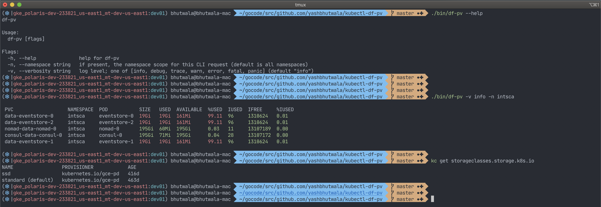

# `kubectl df-pv`

A `kubectl` plugin to see `df` for persistent volumes.

## Requirements

&#9745; `kube-apiserver` has `api/v1/nodes/` endpoint enabled

&#9745; Appropriate RBAC.  This utility is meant for `cluster-admin` like user; specifically, you need a service account with enough RBAC privileges to access `api/v1/nodes/` from the `kube-apiserver`.

&#9745; Using a storage provisioner that populates pv metrics in a compatible manner (see what's been [tested](##Tested) below)

## Quick Start

```shell script
> curl https://krew.sh/df-pv | bash
> # . ~/.bashrc   # run if you use bash shell
> # . ~/.zshrc    # run if you use zsh shell
> kubectl df-pv
```

## Example



## Tested

### Works on

&#9745; **`kubeadm`** configured bare-metal cluster (**`rook-ceph.rbd.csi.ceph.com`** dynamic provisioner)

&#9745; **`GKE`** (**`kubernetes.io/gce-pd`** dynamic provisioner)

### Does not work due to storage provisioner

&#9746; **`kind`** ([**`rancher/local-path-provisioner`** dynamic provisioner](https://github.com/rancher/local-path-provisioner))

&#9746; **`minikube`** ([**`gcr.io/k8s-minikube/storage-provisioner`** minikube-hostpath dynamic provisioner](https://minikube.sigs.k8s.io/docs/handbook/persistent_volumes/))

### TODO

[ ] EKS

[ ] AKS

## TODO Features

&#9745; `df` for all Persistent Volumes in the cluster

&#9745; human readable output as default (using IEC format)

&#9745; color based on usage (i.e.: > 75% = red; > 50% = magenta; > 25% = yellow; default = green)

&#9746; sort-by flag

&#9746; print PV name (right now, it prints the PVC name)

## Motivation

Have you ever wondered, "How much free disk space do all my PVs have?"  Me too!  That's why I built this plugin!  I have always just wanted to quick way to see the disk usage of my Persistent Volumes (similar to [`df`](https://en.wikipedia.org/wiki/Df_(Unix)) or `du` in Unix).  It turns out I'm not the only one, there has been many upstream Kubernetes issues open again and again about this, even some KEPs and PRs.  I have compiled some of the issues and KEPs that I've seen in the wild here:

### Issues

["this feature is needed .. !!!!" - @halradaideh](https://github.com/kubernetes/kubernetes/issues/42465)

["There was a plan to implement this for 1.7 but we ran out of time."](https://github.com/kubernetes/kubernetes/issues/47649)

["I need to know to which Pod(s) a PVC is being mounted to, without having to go through each Pod one by one checking the Volume mounts and the PersistentVolumeClaim."](https://github.com/kubernetes/kubernetes/issues/65233)

### KEPs

["PVC should show how much of the available capacity is used vs available"](https://github.com/kubernetes/enhancements/issues/293)

["Expose storage metrics to end users"](https://github.com/kubernetes/enhancements/issues/363)

["Display PVC capacity usage using kubectl"... "Has this been continued somewhere? It would be super useful"](https://github.com/kubernetes/enhancements/issues/497)

["exposing storage metrics to users"... "Status? Was it done?"](https://github.com/kubernetes/community/pull/855)

### Other relevant/rabbit-hole links

["Volume metrics exposed in /stats/summary not available in /metrics"](https://github.com/kubernetes/kubernetes/issues/34137)

[interesting metric PR](https://github.com/kubernetes/kubernetes/pull/19741/files)

[something similar to du in metrics](https://github.com/kubernetes/kubernetes/blob/v1.16.3/pkg/volume/metrics_du.go)

[client-go issue about kubelet api by @DirectXMan12](https://github.com/kubernetes/client-go/issues/74)

[kubelet stats api](https://github.com/kubernetes/kubernetes/blob/v1.16.3/pkg/kubelet/apis/stats/v1alpha1/types.go)

[kubelet client](https://github.com/kubernetes/kubernetes/tree/v1.16.3/pkg/kubelet/client)

[metrics-server client](https://github.com/kubernetes-sigs/metrics-server/blob/v0.3.6/pkg/sources/summary/client.go)

[blog about kubectl printers and columns](https://blog.mafr.de/2019/04/22/using-kubectl-printers-and-plugins/)

[cli-runtime tableprinter usage](https://github.com/kubernetes/cli-runtime/blob/kubernetes-1.17.0-rc.1/pkg/printers/tableprinter_test.go)

[kubectl using cli-runtime; sorting is still not implemented](https://github.com/kubernetes/kubectl/blob/kubernetes-1.17.0-rc.1/pkg/cmd/get/humanreadable_flags.go#L98)
